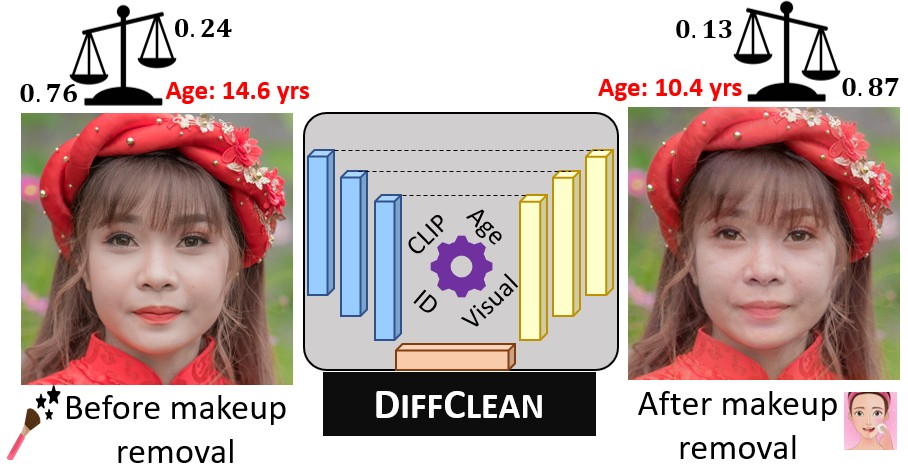

# DiffClean: Diffusion-based Makeup Removal for Accurate Age Estimation
<i>Ekta Gavas, Sudipta Banerjee, Chinmay Hegde and Nasir Memon</i>

[](https://arxiv.org/abs/2507.13292)

Official implementation of paper "DiffClean: Diffusion-based Makeup Removal for Accurate Age Estimation".



## Abstract

Accurate age verification can protect underage users from unauthorized access to online platforms and e-commerce sites that provide age-restricted services. However, accurate age estimation can be confounded by several factors, including facial makeup that can induce changes to alter perceived identity and age to fool both humans and machines. In this work, we propose DiffClean which erases makeup traces using a text-guided diffusion model to defend against makeup attacks without requiring any reference image unlike prior work. DiffClean improves age estimation (minor vs. adult accuracy by 5.8%) and face verification (TMR by 5.1% at FMR=0.01%) compared to images with makeup. Our method is: (1) robust across digitally simulated and real-world makeup styles with high visual fidelity, (2) can be easily integrated as a pre-processing module in existing age and identity verification frameworks, and (3) advances the state-of-the art in terms of biometric and perceptual utility.


## Setup

- ### Clone repo

```shell
git clone https://github.com/Ektagavas/DiffClean.git
```

- ### Build environment

```shell
cd DiffClean
# use anaconda to build environment 
conda env create -f requirements.yml
conda activate diffclean
# install packages
pip install git+https://github.com/openai/CLIP.git
```

## Pretrained models and datasets

- The model checkpoints required for the execution of DiffClean can be requested [here](https://drive.google.com/file/d/14nFKKeZaTVGA4PaIPfdmy7Mr1GuRXF8n/view?usp=drive_link). (Please use your official email id in the access request.) Please unzip the file and move the checkpoints to appropriate locations as shown below.

```shell
mkdir pretrained
mv model_ir_se50.pth pretrained/
mv shape_predictor_68_face_landmarks.dat pretrained/
mkdir checkpoint
mv diffclean_ssr_age.pth checkpoint/
mv diffclean_clip_age.pth checkpoint/
mv ssrnet_finetuned.pth checkpoint/
```

- Please download the target FR models, MT-dataset and target images [here](https://drive.google.com/file/d/1IKiWLv99eUbv3llpj-dOegF3O7FWW29J/view?usp=sharing). Unzip the assets.zip file in `DiffClean/assets`.

## Dataset
We finetuned our models on MT-dataset (following the same instructions as [DiffAM](https://github.com/HansSunY/DiffAM)).
To further finetune the checkpoint on UTKFace, please download the [UTKFace](https://susanqq.github.io/UTKFace/) dataset.
Generate no-makeup - makeup pairs using [EleGANt](https://github.com/Chenyu-Yang-2000/EleGANt/tree/main).

Update the dataset root folder in `configs/paths_config.py` 
Create train/test csvs with the following format and update the paths in `datasets/utkface_dataset.py`:

sample_train.csv
```shell
makeup_name,nomakeup_name,gt_age,makeup_age,nomakeup_age
0001_makeup.jpg,0001_nomakeup.jpg,23,20,24
0002_makeup.jpg,0002_nomakeup.jpg,28,25,28
```

In order to finetune the models on your own dataset, prepare the dataset with makeup/no makeup pairs in above format.

## Quick Start
You can run makeup removal on single image or an entire folder with one of the following commands:

```shell
# single image
python main.py --edit_one_image_MR --config UTK.yml --exp ./runs/{EXP_NAME} --n_iter 1 --t_0 80 --n_inv_step 40 \
--n_train_step 6 --n_test_step 6 --img_path {IMG_PATH} --model_path checkpoint/{MODEL_NAME} --schedule cosine

# folder with images
python main.py --edit_dir_MR --config UTK.yml --exp ./runs/{EXP_NAME} --n_iter 1 --t_0 80 --n_inv_step 40 \
--n_train_step 6 --n_test_step 6 --img_path {FOLDER_PATH} --model_path checkpoint/{MODEL_NAME} --schedule cosine
```

- `IMG_PATH`: Path to an image to test.
- `FOLDER_PATH`: Path to a folder with images.
- `MODEL_NAME`: Path to model checkpoint to test

To get age predictions, setup MiVOLO following the instructions in the repo [MiVOLO](https://github.com/WildChlamydia/MiVOLO) 

## Baselines
To obtain baseline results, follow the instructions from respective repos - [BeautyGAN](https://github.com/Honlan/BeautyGAN), [LADN](https://github.com/wangguanzhi/LADN/tree/master), [PSGAN](https://github.com/wtjiang98/PSGAN), [DiffAM](https://github.com/HansSunY/DiffAM), [Clip2Protect](https://github.com/fahadshamshad/Clip2Protect), [MAD](https://github.com/basiclab/MAD/tree/main).
Please note that for reference-based baselines like BeautyGAN, PSGAN++, LADN, we randomly selected six non-makeup images as references following [DeBeauty](https://ieeexplore.ieee.org/document/10890738). Also, we use input image as the target image and 'no makeup' text prompt to generate makeup-removed version with Clip2Protect. 

## Fine-tuning
- If you want to fine-tune DiffClean for makeup removal on your dataset, please run the following commands:

SSRNet-Age Loss

```shell
python main.py --makeup_removal --config UTK.yml --exp ./runs/diffclean_ssr --do_train 1 --do_test 1 --age_loss_type "ssr" \
--n_train_img 200 --n_test_img 100 --n_iter 5 --t_0 80 --n_inv_step 40 --n_train_step 6 --n_test_step 6 \
--lr_clip_finetune 4e-6 --sch_gamma 1.1 --align_face 1 --schedule cosine --MR_age_loss_w 0.5 \
--model_path checkpoint/diffclean_ssr_age.pth
```

CLIP-Age Loss

```shell
python main.py --makeup_removal --config UTK.yml --exp ./runs/diffclean_clip --do_train 1 --do_test 1 --age_loss_type "clip" \
--n_train_img 200 --n_test_img 100 --n_iter 5 --t_0 80 --n_inv_step 40 --n_train_step 6 --n_test_step 6 \
--lr_clip_finetune 4e-6 --sch_gamma 1.1 --align_face 1 --schedule cosine --MR_age_loss_w 5 \
--model_path checkpoint/diffclean_clip_age.pth
```

Above commands use the provided finetuned SSR-Net checkpoint. In case you want to fine-tune SSR-Net, please follow the instructions [here](SSR_Net_FT/ReadMe.md) and replace the SSR-Net checkpoint path in `losses/age_loss.py`.

## Demo


To run the demo with the DiffClean checkpoints, run the following commands:
```shell
pip install gradio
python app.py
```

Note: To use age estimation feature in the Gradio UI, MiVOLO must be set up first.


## Responsible Usage
 We recognize that our application focus is a sensitive topic, particularly since any modeling or algorithmic errors may adversely impact a vulnerable demographic (minors/teenagers). We strongly advocate for the ethical use of DIFFCLEAN only to assist with facial analytics (not for the purposes of malicious image editing). The authors have not systematically evaluated potential data leakage or memorization issues, including those that may arise from fine-tuned models or downstream applications.
 This code is provided for academic and research purposes in connection with the paper "DiffClean: Diffusion-based Makeup Removal for Accurate Age Estimation". Commercial use is not intended or supported. Please cite the paper when using this code.

```bibtex
@article{gavas2025diffclean,
  title={DiffClean: Diffusion-based Makeup Removal for Accurate Age Estimation},
  author={Gavas, Ekta Balkrishna and Banerjee, Sudipta and Hegde, Chinmay and Memon, Nasir},
  journal={arXiv preprint arXiv:2507.13292},
  year={2025}
}
```

## Acknowledgments

Our code structure is based on [DiffAM](https://github.com/HansSunY/DiffAM).

## Contact
If you have any questions, please contact at eg4131@nyu.edu
